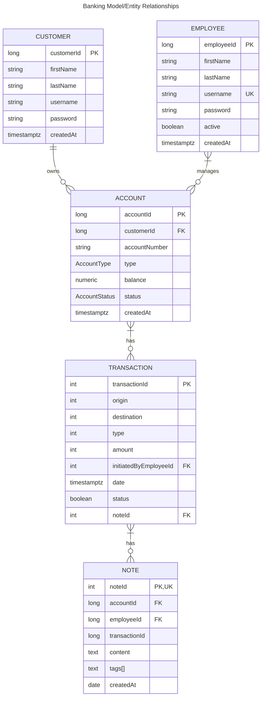

```mermaid
---
title: Banking Model/Entity Relationships
---
erDiagram
    CUSTOMER ||--o{ ACCOUNT : owns
    EMPLOYEE }|--o{ ACCOUNT : manages
    ACCOUNT }|--o{ TRANSACTION : has
    TRANSACTION }|--o{ NOTE : has
    CUSTOMER{
        long customerId PK
        string firstName
        string lastName
        string username
        string password
        timestamptz createdAt
    }
    ACCOUNT{
        long accountId PK
        long customerId FK
        string accountNumber
        AccountType type
        numeric balance
        AccountStatus status
        timestamptz createdAt
    }
    EMPLOYEE{
        long employeeId PK
        string firstName
        string lastName
        string username UK
        string password
        boolean active
        timestamptz createdAt
    }
    TRANSACTION{
        int transactionId PK
        int origin
        int destination
        int type
        int amount
        int initiatedByEmployeeId FK
        timestamptz date
        boolean status
        int noteId FK
    }
    NOTE{
        int noteId PK,UK
        long accountId FK
        long employeeId FK
        long transactionId
        text content
        text tags[]
        date createdAt
    }
```