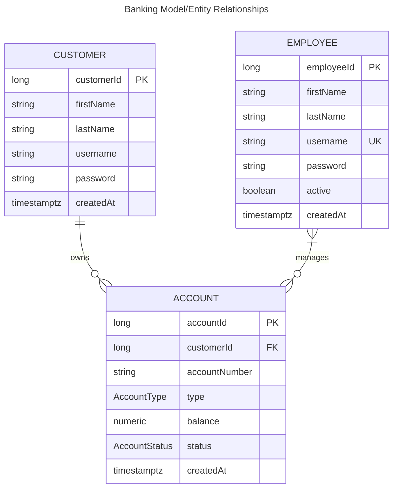

```mermaid
---
title: Banking Model/Entity Relationships
---
erDiagram
    CUSTOMER ||--o{ ACCOUNT : owns
    EMPLOYEE }|--o{ ACCOUNT : manages
    CUSTOMER{
        long customerId PK
        string firstName
        string lastName
        string username
        string password
        timestamptz createdAt
    }
    ACCOUNT{
        long accountId PK
        long customerId FK
        string accountNumber
        AccountType type
        numeric balance
        AccountStatus status
        timestamptz createdAt
    }
    EMPLOYEE{
        long employeeId PK
        string firstName
        string lastName
        string username UK
        string password
        boolean active
        timestamptz createdAt
    }
```