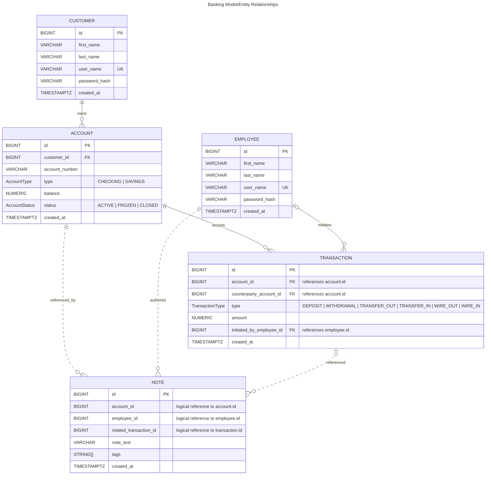

```mermaid
---
title: Banking Model/Entity Relationships
---
erDiagram
    CUSTOMER ||--o{ ACCOUNT : owns
    ACCOUNT ||--o{ TRANSACTION : records
    EMPLOYEE o|--o{ TRANSACTION : initiates
    ACCOUNT ||..o{ NOTE : referenced_by
    EMPLOYEE ||..o{ NOTE : authored
    TRANSACTION o|..o{ NOTE : referenced

    CUSTOMER{
        BIGINT id PK
        VARCHAR first_name
        VARCHAR last_name
        VARCHAR user_name UK
        VARCHAR password_hash 
        TIMESTAMPTZ created_at
    }
    ACCOUNT{
        BIGINT id PK
        BIGINT customer_id FK
        VARCHAR account_number
        AccountType type "CHECKING | SAVINGS"
        NUMERIC balance
        AccountStatus status "ACTIVE | FROZEN | CLOSED"
        TIMESTAMPTZ created_at
    }
    EMPLOYEE{
        BIGINT id PK
        VARCHAR first_name
        VARCHAR last_name
        VARCHAR user_name UK
        VARCHAR password_hash
        TIMESTAMPTZ created_at
    }
    TRANSACTION{
        BIGINT id PK
        BIGINT account_id FK "references account.id"
        BIGINT counterparty_account_id FK "references account.id"
        TransactionType type "DEPOSIT | WITHDRAWAL | TRANSFER_OUT | TRANSFER_IN | WIRE_OUT | WIRE_IN"
        NUMERIC amount
        BIGINT initiated_by_employee_id FK "references employee.id"
        TIMESTAMPTZ created_at
    }
    NOTE{
        BIGINT id PK
        BIGINT account_id "logical reference to account.id"
        BIGINT employee_id "logical reference to employee.id"
        BIGINT related_transaction_id "logical reference to transaction.id"
        VARCHAR note_text
        STRING[] tags
        TIMESTAMPTZ created_at
    }
```

Solid relationships represent PostgreSQL foreign keys.
Dashed relationships represent MongoDB logical references
stored as PostgreSQL IDs inside Mongo documents.