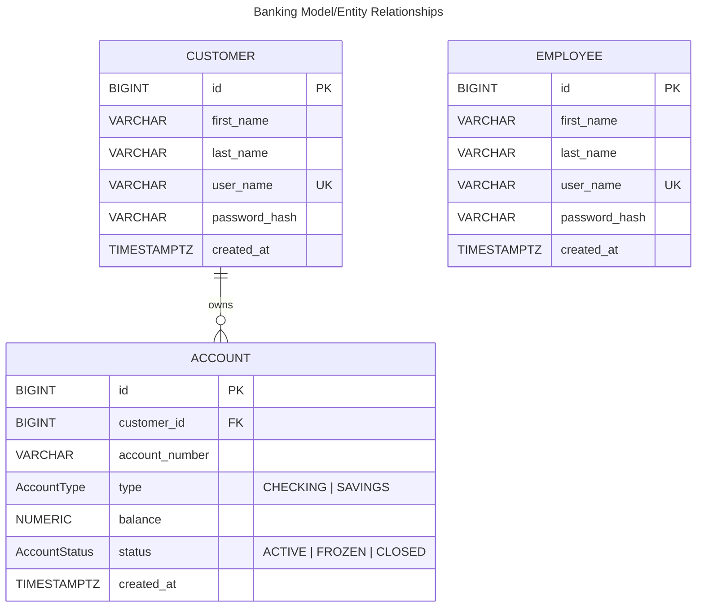

```mermaid
---
title: Banking Model/Entity Relationships
---
erDiagram
    CUSTOMER ||--o{ ACCOUNT : owns

    CUSTOMER{
        BIGINT id PK
        VARCHAR first_name
        VARCHAR last_name
        VARCHAR user_name UK
        VARCHAR password_hash 
        TIMESTAMPTZ created_at
    }
    ACCOUNT{
        BIGINT id PK
        BIGINT customer_id FK
        VARCHAR account_number
        AccountType type "CHECKING | SAVINGS"
        NUMERIC balance
        AccountStatus status "ACTIVE | FROZEN | CLOSED"
        TIMESTAMPTZ created_at
    }
    EMPLOYEE{
        BIGINT id PK
        VARCHAR first_name
        VARCHAR last_name
        VARCHAR user_name UK
        VARCHAR password_hash
        TIMESTAMPTZ created_at
    }
```